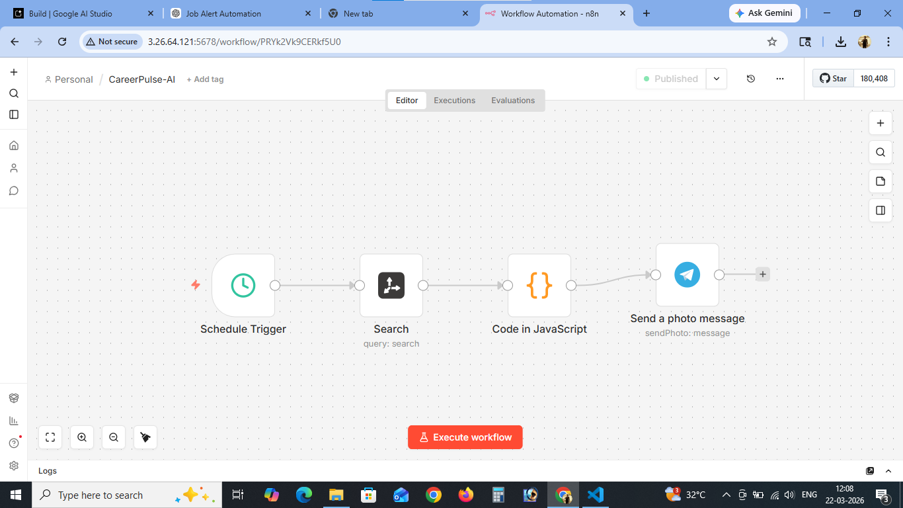
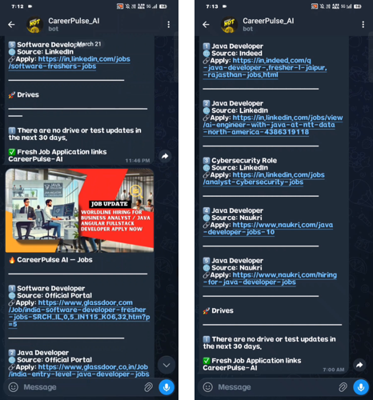

# CareerPulse AI 🚀

## AI-Powered Job Intelligence Automation for Freshers

CareerPulse AI is a cloud-deployed automation system that collects the latest fresher tech jobs, hiring drives, and upcoming tests from multiple platforms, formats them into clean alerts, and delivers them automatically through Telegram.

---

## 📌 Project Overview

This project was built to solve a real daily problem:

* Searching multiple job platforms manually takes time
* Many links lead only to listing pages instead of direct job descriptions
* Important off-campus drives and test registrations are often missed

CareerPulse AI automates this entire process.

---

## ⚙️ Core Workflow Architecture

```text
Schedule Trigger
↓
Tavily Search
↓
JavaScript Processing
↓
Telegram Delivery
```

---

## 🧠 Features

* Scheduled job alerts 3 times daily
* Latest fresher jobs from multiple job platforms
* AI + Cybersecurity job inclusion
* Upcoming hiring drives and test alerts
* Clean title normalization
* Random tech image attachment
* Telegram formatted delivery
* 24/7 cloud deployment

---

## 🛠 Tech Stack

* AWS EC2
* Docker
* n8n
* Tavily API
* Telegram Bot API
* JavaScript

---

## ☁️ Cloud Deployment

Deployed on AWS EC2 using Docker with persistent n8n container.

### Infrastructure:

* Ubuntu server on EC2
* Docker containerized n8n
* Public cloud access
* Auto restart enabled

### Docker Run Configuration

```bash
docker run -d \
--name n8n \
-p 5678:5678 \
-v n8n_data:/home/node/.n8n \
-e TZ=Asia/Kolkata \
-e N8N_SECURE_COOKIE=false \
--restart unless-stopped \
docker.n8n.io/n8nio/n8n
```

---

## 🔄 Workflow Logic

### 1. Schedule Trigger

Runs every day at:

* 7:00 AM
* 2:00 PM
* 8:00 PM

Cron:

```text
0 7,14,20 * * *
```

---

### 2. Tavily Search Query

Used for collecting direct job links:

```text
latest fresher software developer, java developer, data analyst, AI engineer, cybersecurity jobs in India direct job pages official apply links from linkedin jobs view, indeed, naukri, foundit, wellfound, official careers only; exclude search pages and homepages; include recent individual posts plus hiring drives and tests within next 15 days with registration links
```

---

### 3. JavaScript Processing

The code node performs:

* Job title normalization
* Link filtering
* Drive/test extraction
* Random image selection
* Telegram-safe formatting

---

### 4. Telegram Delivery

Output contains:

* Random tech image
* 4 job alerts
* 2 drive/test updates
* Clean caption formatting

---


## 🖼 Workflow Screenshot



## Telegram Preview 

<p align="center">
  
</p>


---

## 🎥 Demo Video


[Watch Demo Video](https://drive.google.com/file/d/1i3ysCgDf3Be-pOvSLJMnGeKaFwiOVujG/view?usp=sharing)
<video src="demo/demo.mp4" controls width="800"></video>


Recommended:

* Loom
* YouTube Unlisted
* Google Drive public link

---

## 📂 Repository Structure

```text
CareerPulse-AI/
├── workflow/
│   └── CareerPulse_AI_Workflow.json
├── screenshots/
│   ├── workflow.png
│   └── telegram-output.png
├── README.md
```

---

## 🚀 Future Improvements

* WhatsApp integration
* Personalized role targeting
* Duplicate prevention memory
* Resume-based filtering
* Direct company scoring

---

## 💡 Portfolio Value

This project demonstrates:

* Cloud deployment
* Automation design
* API integration
* Production workflow thinking
* Real-world utility product development

---

## 👨‍💻 Author

Ajay Paka
